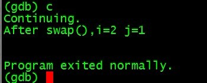

####linux下如何用GDB调试c++程序
来源：http://blog.csdn.net/wfdtxz/article/details/7368357 

GDB是GNU开源组织发布的一个强大的UNIX下的程序调试工具。或许，各位比较喜欢那种图形界面方式的，像VC、BCB等IDE的调试，但如果你是在 UNIX平台下做软件，你会发现GDB这个调试工具有比VC、BCB的图形化调试器更强大的功能。所谓“寸有所长，尺有所短”就是这个道理。 一般来说，GDB主要帮忙你完成下面四个方面的功能： 

1 启动你的程序，可以按照你的自定义的要求随心所欲的运行程序。
2 可让被调试的程序在你所指定的调置的断点处停住。（断点可以是条件表达式）
3 当程序被停住时，可以检查此时你的程序中所发生的事。
4 动态的改变你程序的执行环境。

 从上面看来，GDB和一般的调试工具没有什么两样，基本上也是完成这些功能，不过在细节上，你会发现GDB这个调试工具的强大，大家可能比较习惯了图形化的调试工具，但有时候，命令行的调试工具却有着图形化工具所不能完成的功能。让我们一一看来。 

 gdb基本命令列表： 

 实例: 
1新建一个源文件vi swap.cc 
源文件内容如下： 
	#include<iostream>
	using namespace std;
	void swap(int &a,int &b)
	{
        	int tmp;
	        tmp=a;
	        a=b;
	        b=tmp;
	}
	
	int main()
	{
	        int i,j;
	        cout<<endl<<"Input two int number:"<<endl;
	        cin>>i>>j;
	        cout<<"Before swap(),i="<<i<<" j="<<j<<endl;
	        swap(i,j);
	        cout<<"After swap(),i="<<i<<" j="<<j<<endl<<endl;
	        return 0;
	}
	

2生成可执行文件 g++ -g -o swap swap.cc，**注意必须使用-g参数**，编译会加入调试信息，否则无法调试执行文件 

3启动调试 gdb swap 

3.1查看源文件 list 1，回车重复上一次指令 

3.2设置调试断点 break 16，在第16行设置断点，info break查看断点信息（亦可使用缩写i b ） 

3.3调试  运行 输入run 或者r  

3.3单步调试，step 或者 s进入函数内部 

3.4查看变量 print b 或者 p b 

3.5查看函数堆栈bt，退出函数finish 

3.6继续运行直到下一个断点或主函数结束continue或者c 

3.7退出调试 输入q 

 

